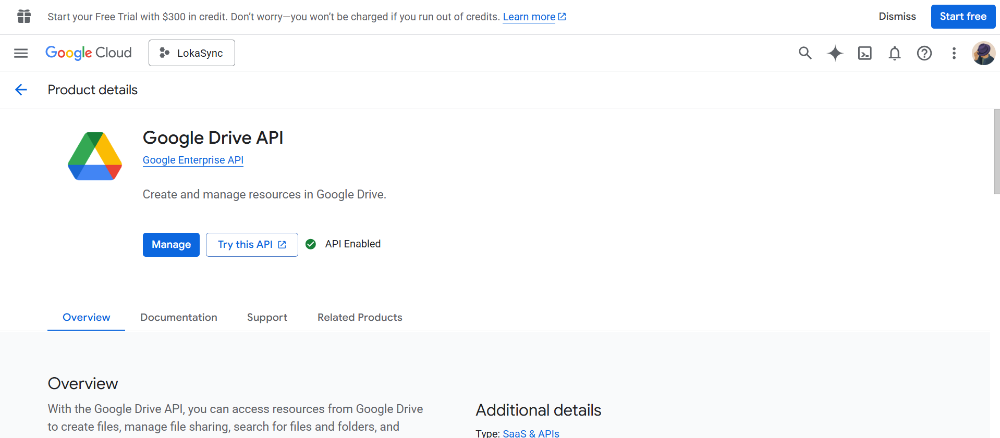
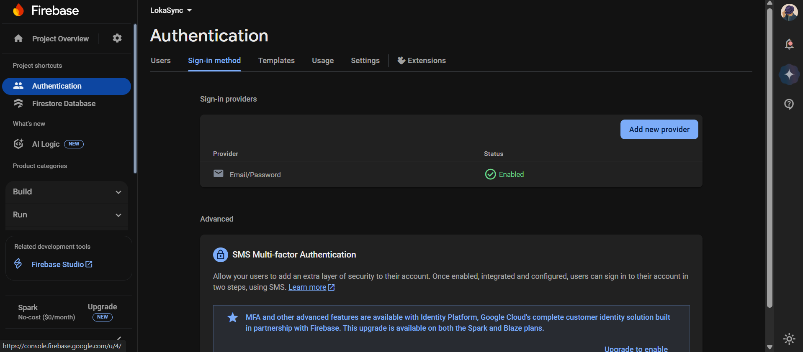
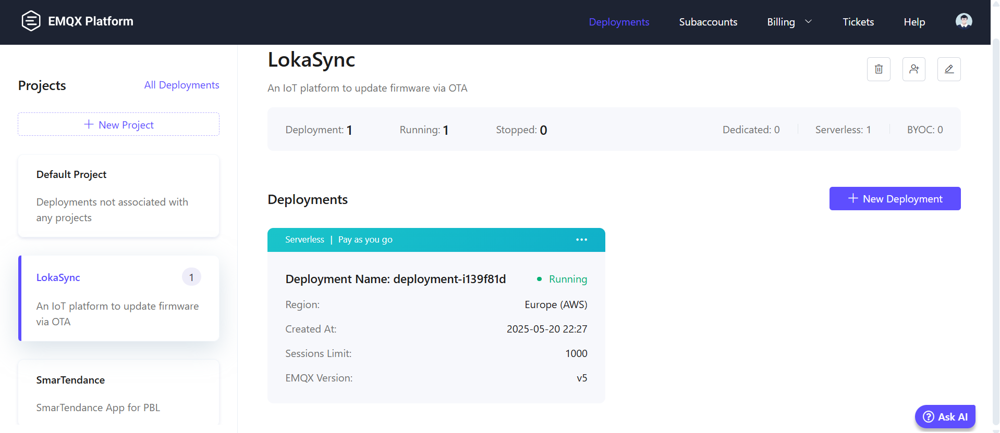

<header>
  <div align="center">

  

  <h1>LokaSync Web App</h1>

  <p>
    
    
  </p>

  <p>
    
    
    
    
    
    
  </p>

  </div>
</header>

---

## 👋 Introducing Our App

**What is LokaSync ?**
> LokaSync is a solution to make update firmware of your ESP devices more efficient, because it will update via Over-The-Air (OTA). Simply, our app is a **firmware version control** for your ESP devices.

**What happens if incorrect firmware is uploaded?**

> *It's your fault, not our team*. 🤭
Traditionally, a mistake made during firmware flashing, such as setting incorrect configuration values, it **requires a manual re-flash of the ESP device**. This process is time-consuming and prone to error, especially for multiple devices deployed in various locations. So, it's crucial to **double check that firmware versions are verified** before an update is initiated.

**Why choose LokaSync?**

> *Because it's blazingly fast and secure*. ⚡
LokaSync is built for **efficiency and security**. Firmware data is transmitted securely and with minimal bandwidth usage by leveraging the MQTT(S) protocol. 🚀
User authentication is managed by Google through Firebase Authentication, ensuring that sensitive credentials are not handled or stored by our application.

## 🖥️ Development Environment

### 🏡 The FARM Stack

- **[FastAPI](https://fastapi.tiangolo.com/)** — Used for backend API service.
- **[ReactJS](https://react.dev)** — Used for responsive frontend Single-Page Application (SPA).
- **[MongoDB](https://www.mongodb.com)** — Used as NoSQL database engine.

🔥 **Additional Tools and Libraries:**

- **[Vite](https://vite.dev)** — Frontend build tool and development server.
- **[TailwindCSS 4](https://tailwindcss.com/docs/installation/using-vite)** — Utility-first CSS framework.
- **[Shadcn/ui](https://ui.shadcn.com/docs)** — Composable and accessible UI components.
- **[reactbits-squares](https://www.reactbits.dev/backgrounds/squares)** — Animated background component.

### 🔐 Authentication System

Authentication is managed by Firebase Auth, providing a secure and reliable identity management system handled by Google.

### 🗂️ Cloud Storage

Firmware files are securely stored in the cloud using the Google Drive API. A service account key (JSON format) is required to authorize programmatic file uploads.

### 📡 Communication Protocol

The application utilizes the MQTT(S) protocol for firmware update and real-time communication. While EMQX Cloud is the recommended broker, any compatible MQTT broker (e.g., HiveMQ, Mosquitto) can be configured, provided it is accessible by all system components.

### 🐳 Containerized Deployment

The LokaSync application is containerized using Docker and orchestrated with Docker Compose. The environment consists of 4 main services:

- `mongo:8.0` — Provides the NoSQL database service.
- `python:3.13-alpine` — Runs the FastAPI backend application.
- `node:22.15.0-alpine` — Builds the static React frontend assets.
- `nginx:stable-alpine` — Acts as a reverse proxy, directing traffic to the frontend or backend service.

## ✨ Features

| Description | Status |
| ----------- | :----: |
| Over-the-Air (OTA) firmware updates for single devices (Cloud OTA)| ✅ |
| Real-time logging of the firmware update process | ✅ |
| Log export functionality (PDF or CSV) | ✅ |
| Automatic firmware storage on Google Drive | ✅ |
| Modern UI with a default dark theme | ✅ |
| User profile customization | ✅ |
| **Bonus**: Real-time sensor data monitoring (tested for `humidity` and `temperature`) | ✅ |
| **In Progress**: Group OTA updates for multiple nodes | ⌛ |
| **In Progress**: Local OTA updates via ESP Access Point mode | ⌛ |

## ℹ️ Usage

### 🔽 Clone the Repository

```shell
git clone github.com/LokaSync/LokaSync
cd LokaSync
```

### 🗃️ Setup Google Drive API



- Navigate to the **[Google Cloud Console](https://console.cloud.google.com/)** and create a new project.
- Go to **APIs & Services** → **Enabled APIs & services**, search for and enable the **Google Drive API**.
- In the **Credentials** section, a new **Service Account** should be created. A name must be provided and the **Editor** role should be assigned to it.
- Within the new service account, navigate to the **Keys** tab and add a new key of type **JSON**.
- The JSON key file will be downloaded automatically. This file must be placed in the `backend/` folder.
- A new folder must be created in your personal Google Drive. This folder must then be shared with the email address that was generated for the service account. The **Editor** role should be granted to the service account during the sharing process.
- The ID for this new folder can be obtained from its URL. For example, if the URL is [https://drive.google.com/drive/folders/XXXXXX](https://drive.google.com/drive/folders/XXXXXX), the **Folder ID** is `XXXXXX`.
- Finally, the `GOOGLE_DRIVE_CREDS_NAME` (the name of your JSON file) and the `GOOGLE_DRIVE_FOLDER_ID` variables must be set in the backend's `.env` file.
- For a detailed walkthrough, this article may be helpful: [Python and Google Drive Tutorial](https://dev.to/binaryibex/python-and-google-drive-how-to-list-and-create-files-and-folders-2023-2nmm).

### 🔐 Create Firebase Authentication



- Create a new project in the [Firebase Console](https://console.firebase.google.com/).
- Navigate to the **Authentication** section and enable the **Email/Password** sign-in method.
- From your Firebase project settings, **generate and download a new private key** (service account JSON file).
- Place the downloaded JSON file into the `backend/` folder.
- Set the `FIREBASE_CREDS_NAME` variable in the backend's `.env` file.
- Copy the web app configuration details from Firebase and populate the corresponding `VITE_FIREBASE_*` variables in the frontend's `.env` file.

### 📡 Setup MQTT Broker



- An MQTT broker is required. A free-tier instance from [EMQX Cloud](https://www.emqx.com/en/cloud) can be used, or you may deploy a local broker.
- Once the broker is running, configure the connection details in the `.env` files for both the backend and frontend, including the broker username and password.
- If MQTTS is used, the broker's CA certificate file must be placed in the `backend/` folder and its path specified in the configuration. The frontend does not require this certificate file for WebSocket connections.

### ⚙️ Configure Backend `.env` File

Create a `.env` file in the `backend/` folder and populate it with the following:

```txt
MONGO_CONNECTION_URL=mongodb://localhost:27017/ # Use `mongodb://mongodb/` if running with docker-compose.
MONGO_DATABASE_NAME=test_db
MQTT_BROKER_URL=broker.emqx.io
MQTT_BROKER_PORT=1883
FIREBASE_CREDS_NAME=firebase-credentials.json
GOOGLE_DRIVE_CREDS_NAME=gdrive-credentials.json
GOOGLE_DRIVE_FOLDER_ID=REDACTED
TIMEZONE=Asia/Jakarta # Adjust timezone according to your location.
```

### ⚙️ Configure Frontend `.env` File

Create a `.env` file in the `frontend/` folder and populate it with the following:

```txt
VITE_FIREBASE_API_KEY=REDACTED
VITE_FIREBASE_AUTH_DOMAIN=REDACTED
VITE_FIREBASE_PROJECT_ID=REDACTED
VITE_FIREBASE_STORAGE_BUCKET=REDACTED
VITE_FIREBASE_MESSAGING_SENDER_ID=REDACTED
VITE_FIREBASE_APP_ID=REDACTED
VITE_BASE_API_URL=http://localhost:8000
VITE_MQTT_BROKER_URL=ws://broker.emqx.io:8083/mqtt
```

> ⚠️ **Important**: Ensure all environment variables are set correctly before proceeding.

## 🚀 Run the App Locally

Once the setup and configuration are complete, the application can be run locally using one of the following methods.

### 1️⃣ Manual Setup (Without Docker)

> 📓 **Note**: Python version `^3.13.0` and NodeJS version `^22.15.0` (LTS) are required.

- **[Run MongoDB](https://www.mongodb.com/docs/manual/installation/)**: Ensure a MongoDB instance is running and accessible. Refer to the [official installation guide](https://www.mongodb.com/docs/manual/installation/).
- **Run Backend (FastAPI)**:

```shell
cd backend/
# Create new python virtual env.
# For Linux/MacOS.
python3 -m venv .venv
source .venv/bin/activate
pip3 install --upgrade -r requirements.txt --no-cache-dir # Install dependencies.

# For Windows-PowerShell.
python.exe -m venv .venv
.venv/Scripts/Activate.ps1
pip.exe install --upgrade -r requirements.txt --no-cache-dir

# Go to src folder.
cd src/
uvicorn main:app --reload # Using debug mode.
uvicorn main:app # Using production mode.

# FastAPI will be serve on http://localhost:8000/api/v1/docs
```

- **Run Frontend (React)**:

```shell
cd frontend/
npm i # Install dependencies.
npm run dev # For development mode.
npm run build # For production ready.

# React app will be serve on http://localhost:3000
```

### 2️⃣ Dockerized Setup

- This is the recommended method for a streamlined setup.
- Change the `MONGO_CONNECTION_URL` in your backend `.env` file with `mongodb://mongodb/`. If not, the `lokasync-backend` container cannot connect with `lokasync-mongodb` container.
- Create a new `.env` file for your `docker-compose.yml`.

```txt
# Database Configuration
MONGO_USERNAME=
MONGO_PASSWORD=
MONGO_DATABASE=test_db
MONGO_PORT=27017

# Backend Configuration
BACKEND_PORT=8000

# Frontend Configuration
FRONTEND_PORT=3000

# Environment
NODE_ENV=production
```

- Finally, we can execute the `docker-compose.yml` using this command.

```shell
# This command will build the images and start all services in detached mode.
docker-compose up -d

# On some Linux distributions, sudo may be required.
sudo docker-compose up -d
```

## ▶️ Demo Video

🎥 *Coming Soon*.

## ⚔️ LokaSync Team

| Name | Student ID (NIM) | Roles |
| ---- | --- | -------- |
| Alfarizki Nurachman | 2207421041 | Back-end Developer |
| Itsar Hevara | 2207421046 | Team Manager + IoT Developer |
| Jonathan Victorian Wijaya | 2207421051 | IoT Developer |
| Wahyu Priambodo | 2207421048 | Web Pentester + Front-end Developer |

## 📬 Contact

- LokaSync Team: [Itsar Hevara](mailto:itsar.hevara.tik22@mhsw.pnj.ac.id)
- Lokatani: [Official contact](https://lokatani.id/contact-us)

---

<footer style="display: flex; justify-content: space-between; align-items: center; font-size: 0.9rem; padding: 1em 0;">
  <span>&copy; 2025 - LokaSync</span>
  <span>Supported by PNJ and Lokatani.</span>
</footer>
